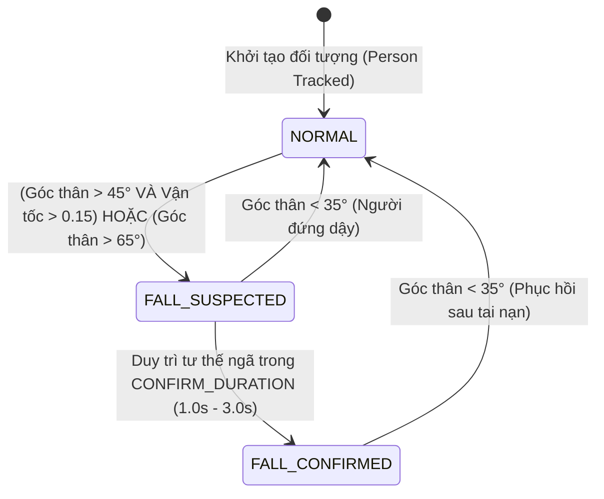

# TÀI LIỆU NGỮ CẢNH DỰ ÁN (PROJECT CONTEXT) - HỆ THỐNG NHẬN DIỆN TÉ NGÃ (FALL DETECTION AI)

---

## 1. TỔNG QUAN DỰ ÁN & ĐỀ TÀI
- **Tên đề tài đề xuất:**
  - *Hướng Kỹ thuật / Đồ án tốt nghiệp:* **Nghiên cứu và xây dựng hệ thống giám sát, cảnh báo té ngã thời gian thực dựa trên thị giác máy tính và kiến trúc C# .NET**
  - *Hướng Nghiên cứu Khoa học (NCKH):* **Nghiên cứu phương pháp phát hiện té ngã thời gian thực đa đối tượng sử dụng ước lượng tư thế YOLOv8-Pose kết hợp máy trạng thái hữu hạn (FSM)**
  - *Tên tiếng Anh:* **Real-time Multi-Person Fall Detection and Emergency Alert System Using YOLOv8-Pose and FSM Integrated with .NET Architecture**
- **Mục tiêu:** Phát hiện sự cố té ngã của con người tự động, theo thời gian thực từ camera/webcam giám sát; loại trừ báo động giả (False Alarms) khi cúi/ngồi; hỗ trợ giám sát đồng thời nhiều người (Multi-Person Tracking) và tích hợp đẩy dữ liệu cảnh báo khẩn cấp lên Backend C# (.NET Core).
- **Công nghệ cốt lõi:**
  - **Module AI Client:** Python 3.x, Ultralytics YOLOv8-Pose / YOLO11-Pose (17 COCO keypoints), OpenCV, PyTorch (CUDA / Apple Silicon MPS), NumPy.
  - **Theo dõi đối tượng (Multi-Object Tracking):** ByteTrack / BoT-SORT tích hợp trong YOLO duy trì định danh (`track_id`).
  - **Giải thuật suy luận:** Kết hợp góc nghiêng thân người (Body Angle), tỉ lệ khung bao (Aspect Ratio $W/H$), vận tốc trọng tâm (Centroid Velocity), và Máy trạng thái hữu hạn độc lập (Per-Person FSM).
  - **Backend & Tích hợp:** C# (.NET Core / ASP.NET Core Web API / SignalR) tiếp nhận bản tin JSON, lưu trữ cơ sở dữ liệu, kích hoạt thông báo (Push Notification / SMS) và truyền dữ liệu lên Web/App Dashboard.

---

## 2. CẤU TRÚC THƯ MỤC & CÁC MODULE CHÍNH
```text
fall-detection-ai/
├── CONTEXT.md                      # Tài liệu kiến trúc và ngữ cảnh tổng quan dự án
├── REALTIME_CONTEXT.md             # Tài liệu ngữ cảnh chuyên sâu module Real-time Webcam (YOLO-Pose)
├── realtime_yolo_fall_detection.py # Module nhận diện té ngã Real-time qua Webcam (YOLO26 / YOLOv8 Pose + Multi-person)
├── yolo_fall_detection.py          # Module YOLOv8m-Pose + Multi-Person Tracking + State Machine (Tối ưu độ chính xác cao)
├── video_fall_detection_yolo.py    # Module YOLO11n-Pose xử lý video đa người
├── mediapipe_test.py               # Module nhận diện té ngã Real-time qua Webcam (MediaPipe Pose)
├── video_fall_detection.py         # Module xử lý video offline qua MediaPipe Pose
├── requirements.txt                # Danh sách thư viện phụ thuộc Python
├── yolo26n-pose.pt                 # Trọng số mô hình YOLO26 Nano Pose (~7.8MB - NMS-Free SOTA)
├── yolov8m-pose.pt                 # Trọng số mô hình YOLOv8 Medium Pose (~53MB)
├── yolov8n-pose.pt                 # Trọng số mô hình YOLOv8 Nano Pose (~6.8MB)
└── yolo11n-pose.pt                 # Trọng số mô hình YOLO11 Nano Pose (~6.2MB)
```

---

## 3. NGUYÊN LÝ HOẠT ĐỘNG & THUẬT TOÁN

### 3.1. So sánh 2 nhánh trích xuất đặc trưng tư thế (Pose Extraction)
| Đặc tính | Nhánh MediaPipe Pose | Nhánh YOLO Pose (YOLOv8 / YOLO11) |
| :--- | :--- | :--- |
| **Số lượng điểm mốc (Keypoints)** | 33 điểm mốc (BlazePose) | 17 điểm mốc (Chuẩn COCO) |
| **Khả năng Multi-Person** | Hạn chế (ưu tiên 1 người chính) | Mạnh mẽ (Theo dõi không giới hạn số người với `track_id`) |
| **Lọc nhiễu đối tượng** | Dễ nhầm khi có vật thể/xe cộ | Lọc tuyệt đối `classes=[0]` (chỉ nhận diện người) |
| **Hiệu năng phát hiện ở xa** | Trung bình | Rất tốt khi đặt độ phân giải `imgsz=1280` |
| **Các điểm mốc trọng yếu** | Vai (11, 12), Hông (23, 24) | Vai (5, 6), Hông (11, 12), Đầu gối (13, 14), Cổ chân (15, 16) |

### 3.2. Các chỉ số tính toán cốt lõi
1. **Góc nghiêng thân người (Body Angle):**
   - Lấy trung điểm vai ($Mid_{shoulder}$) và trung điểm hông ($Mid_{hip}$).
   - Tính góc nghiêng so với phương thẳng đứng:
     $$\text{Angle} = \arctan\left(\frac{|\Delta x|}{|\Delta y| + 10^{-6}}\right) \times \frac{180}{\pi}$$
   - Góc $\text{Angle} \approx 0^\circ - 30^\circ$: Tư thế đứng / ngồi thẳng.
   - Góc $\text{Angle} > 45^\circ - 50^\circ$: Tư thế nghiêng nhiều hoặc nằm ngang sàn.
2. **Trọng tâm cơ thể (Centroid):**
   - Tọa độ trung bình của 4 điểm: 2 vai và 2 hông trên mặt phẳng chuẩn hóa.
3. **Tốc độ dịch chuyển trọng tâm (Movement Speed):**
   - Lưu trữ lịch sử vị trí và mốc thời gian trong hàng đợi (`deque`) gồm 5 frames gần nhất.
   - Vận tốc = Tổng quãng đường Euclidean di chuyển / Tổng thời gian ($\text{khoảng cách / giây}$).
   - Giúp phân biệt giữa việc **ngã đột ngột** với việc **chủ động nằm xuống từ từ**.

---

## 4. MÁY TRẠNG THÁI (STATE MACHINE) ĐA ĐỐI TƯỢNG

Mỗi người được phát hiện sẽ gắn với một instance `PersonTracker(track_id)` sở hữu một máy trạng thái riêng biệt:



### Chi tiết các trạng thái:
1. **`NORMAL` (Bình thường - Box màu xanh lá):**
   - Đối tượng đang đứng, đi bộ, hoặc ngồi bình thường.
   - Điều kiện chuyển sang `FALL_SUSPECTED`: Khi đồng thời xảy ra **tư thế nằm** (`body_angle > ANGLE_THRESHOLD`) kèm **vận tốc biến thiên nhanh** (`speed > SPEED_THRESHOLD`), hoặc ngã với góc rất lớn (`body_angle > 65°`).
2. **`FALL_SUSPECTED` (Nghi ngờ té ngã - Box màu cam):**
   - Bắt đầu tính thời gian duy trì tư thế ngã.
   - Nếu đối tượng tự đứng dậy (`body_angle < 35°`), hủy nghi ngờ và quay về `NORMAL`.
   - Nếu đối tượng tiếp tục nằm bất động vượt quá `CONFIRM_DURATION`, chuyển sang `FALL_CONFIRMED`.
3. **`FALL_CONFIRMED` (Xác nhận té ngã - Box màu đỏ / Cảnh báo toàn màn hình):**
   - Xác nhận sự cố khẩn cấp. Kích hoạt lưu vết frame và sẵn sàng bắn API/MQTT cảnh báo.
   - Tự động quay về `NORMAL` khi đối tượng hồi phục và đứng dậy (`body_angle < 35°`).

---

## 5. THÔNG SỐ CẤU HÌNH HỆ THỐNG (HYPERPARAMETERS)

| Tham số | YOLOv8m (Video Offline) | YOLO26n / YOLOv8n (Real-time Webcam) | MediaPipe (Webcam) | Ý nghĩa |
| :--- | :--- | :--- | :--- | :--- |
| `MODEL_NAME` | `yolov8m-pose.pt` | `yolo26n-pose.pt` (Mặc định) / `yolov8n-pose.pt` | `mp.solutions.pose` | Mô hình Pose Estimation sử dụng |
| `imgsz` | `1280` | `640` | `640x480` | Độ phân giải khung hình đưa vào mạng suy luận |
| `conf` / `TRACK_CONFIDENCE` | `0.15` | `0.25` | `0.5` | Ngưỡng độ tin cậy để duy trì tracking kể cả khi bị che khuất |
| `ANGLE_THRESHOLD` | `50°` | `50°` | `50°` | Ngưỡng góc nghiêng xác định tư thế nằm |
| `SPEED_THRESHOLD` | `0.20` | `0.20` | `0.35` | Ngưỡng tốc độ dịch chuyển trọng tâm đột ngột |
| `ASPECT_RATIO_THRESHOLD` | `0.88` | `0.88` | *(Không có)* | Tỉ lệ $W/H$ Bounding Box chống báo động giả khi cúi/gập người |
| `CONFIRM_DURATION` | `2.0s` | `2.5s` | `3.0s` | Thời gian bất động tối thiểu để xác nhận té ngã |

---

## 6. HƯỚNG DẪN SỬ DỤNG VÀ THỰC THI

### 6.1. Chạy nhận diện trực tiếp qua Webcam (Real-time bằng YOLO Pose - Đa người)
```bash
# Chạy với webcam mặc định (Index 0) và model mặc định yolo26n-pose.pt (hoặc yolov8n-pose.pt)
python realtime_yolo_fall_detection.py

# Hoặc chỉ định webcam index và model tùy chọn (vd: yolo26n-pose.pt, yolov8n-pose.pt, yolov8m-pose.pt)
python realtime_yolo_fall_detection.py 0 yolo26n-pose.pt
```
- Phím tắt tương tác:
  - `q` hoặc `ESC`: Thoát chương trình.
  - `r`: Reset tất cả trạng thái về `NORMAL`.
  - `f`: Bật/Tắt chế độ lật gương (Mirror Mode).
  - `s`: Lưu ảnh chụp màn hình (Snapshot).

### 6.2. Chạy nhận diện YOLOv8 Pose trên file Video (Đa người)
```bash
# Xử lý video mặc định (test/video_6.mp4 -> test/video_6_yolov8m_output.mp4)
python yolo_fall_detection.py

# Xử lý video tùy chọn
python yolo_fall_detection.py <duong_dan_input.mp4> <duong_dan_output.mp4>
```

### 6.3. Chạy nhận diện trực tiếp qua Webcam (Real-time bằng MediaPipe)
```bash
python mediapipe_test.py
```
- Phím tắt:
  - `q`: Thoát chương trình.
  - `r`: Reset thủ công trạng thái về `NORMAL`.

### 6.4. Chạy kiểm tra video bằng MediaPipe
```bash
python video_fall_detection.py <duong_dan_input.mp4> <duong_dan_output.mp4>
```

---

## 8. THÔNG TIN DATASET VÀ MÔ HÌNH HUẤN LUYỆN (DATASET & PRETRAINED MODELS)

### 8.1. Tập dữ liệu huấn luyện mặc định (Default Pretrained Dataset)
- **Tên Dataset:** **COCO 2017 Keypoint Detection Dataset** (`coco-pose`).
- **Quy mô dữ liệu:** ~118,287 ảnh huấn luyện (Train), ~5,000 ảnh validation chứa hơn 156,000 đối tượng người ở mọi tư thế thực tế (ngồi, nằm, ngã, đi lại, hoạt động thể thao).
- **Cấu trúc Keypoints (17 điểm mốc chuẩn COCO):**
  - Mũi (0), Mắt (1, 2), Tai (3, 4).
  - Vai trái/phải (5, 6), Khuỷu tay (7, 8), Cổ tay (9, 10).
  - Hông trái/phải (11, 12), Đầu gối (13, 14), Cổ chân (15, 16).
- **Trọng số sử dụng trong dự án:**
  - `yolo26n-pose.pt` (Mô hình YOLO26 Nano: ~7.8MB, kiến trúc Native NMS-Free SOTA, loại bỏ DFL, tối ưu độ trễ deterministic và tốc độ cao).
  - `yolov8n-pose.pt` (Mô hình Nano: 6.8MB, mAP Pose 50.4%, tối ưu tốc độ 30-60+ FPS).
  - `yolov8m-pose.pt` (Mô hình Medium: 53MB, độ chính xác cao hơn cho video offline).
  - `yolo11n-pose.pt` (Mô hình YOLO11 Thế hệ mới: 6.2MB).

### 8.2. Đường link tham khảo chính thức (Official Links)
- **Ultralytics Pose Documentation:** [https://docs.ultralytics.com/datasets/pose/](https://docs.ultralytics.com/datasets/pose/)
- **Ultralytics COCO-Pose Guide:** [https://docs.ultralytics.com/datasets/pose/coco/](https://docs.ultralytics.com/datasets/pose/coco/)
- **COCO Dataset Official:** [https://cocodataset.org/#keypoints-2017](https://cocodataset.org/#keypoints-2017)

---

## 9. ĐỊNH HƯỚNG NÂNG CẤP & MỞ RỘNG (ROADMAP)
1. **Hoàn thiện module AI Edge Realtime:** Đã hoàn thành trong `realtime_yolo_fall_detection.py` với tối ưu FPS (DirectShow/MJPG + GPU CUDA/MPS), bộ lọc $W/H \ge 0.88$ chống báo động giả.
2. **Tích hợp Backend C# (.NET Core Web API):** Xây dựng background worker thread bên Python để đẩy sự kiện khẩn cấp sang C# Backend không làm suy giảm FPS camera.
3. **Phát triển Web/Mobile Dashboard:** C# Backend phát tín hiệu qua SignalR tới giao diện điều hành thời gian thực.
4. **Mô hình chuỗi thời gian (Spatio-Temporal GCN / LSTM):** Nghiên cứu mở rộng khi cần nhận diện các hành vi tương đồng (nằm tập yoga, nhặt đồ nhiều lần).

---

## 10. THIẾT KẾ GIAO TIẾP VỚI C# BACKEND (.NET CORE)

### 10.1. Chuẩn JSON Payload Cảnh báo Té ngã Khẩn cấp (`POST /api/alerts/fall`)
Bắn ra khi trạng thái chuyển sang `FALL_CONFIRMED`:
```json
{
  "eventId": "evt_1725453456000",
  "eventType": "FallConfirmed",
  "severity": "Critical",
  "timestamp": "2026-09-04T20:37:35+07:00",
  "cameraId": "CAM_01",
  "location": "Living Room",
  "person": {
    "trackId": 1,
    "state": "FALL_CONFIRMED",
    "bodyAngle": 84.5,
    "aspectRatio": 2.15,
    "boundingBox": {
      "x1": 150,
      "y1": 320,
      "x2": 560,
      "y2": 450
    }
  },
  "snapshotBase64": "data:image/jpeg;base64,..."
}
```

### 10.2. Chuẩn JSON Payload Khi Nạn nhân Đứng dậy (`POST /api/alerts/recovered`)
Bắn ra khi trạng thái chuyển từ `FALL_CONFIRMED` về `NORMAL`:
```json
{
  "eventId": "evt_1725453490000",
  "eventType": "Recovered",
  "severity": "Info",
  "timestamp": "2026-09-04T20:38:10+07:00",
  "cameraId": "CAM_01",
  "person": {
    "trackId": 1,
    "state": "NORMAL",
    "bodyAngle": 15.0,
    "aspectRatio": 0.42
  }
}
```

### 10.3. Mô hình C# DTO Class (ASP.NET Core)
```csharp
namespace FallDetectionBackend.DTOs
{
    public class FallAlertDto
    {
        public string EventId { get; set; } = string.Empty;
        public string EventType { get; set; } = string.Empty; // "FallConfirmed" | "Recovered"
        public string Severity { get; set; } = "Critical";
        public DateTimeOffset Timestamp { get; set; }
        public string CameraId { get; set; } = string.Empty;
        public string? Location { get; set; }
        public PersonDetailDto Person { get; set; } = new();
        public string? SnapshotBase64 { get; set; }
    }

    public class PersonDetailDto
    {
        public int TrackId { get; set; }
        public string State { get; set; } = string.Empty;
        public double BodyAngle { get; set; }
        public double AspectRatio { get; set; }
        public BoundingBoxDto? BoundingBox { get; set; }
    }

    public class BoundingBoxDto
    {
        public int X1 { get; set; }
        public int Y1 { get; set; }
        public int X2 { get; set; }
        public int Y2 { get; set; }
    }
}
```

### 10.4. Kiến trúc SignalR Hub & Alert Controller (.NET Core)
Để phát cảnh báo thời gian thực từ C# Backend tới Web/Mobile Dashboard mà không cần polling:

```csharp
using Microsoft.AspNetCore.Mvc;
using Microsoft.AspNetCore.SignalR;
using FallDetectionBackend.DTOs;

namespace FallDetectionBackend.Hubs
{
    public class FallAlertHub : Hub
    {
        // Hub cho Web Client / Mobile Dashboard lắng nghe sự kiện
        public async Task JoinCameraGroup(string cameraId)
        {
            await Groups.AddToGroupAsync(Context.ConnectionId, cameraId);
        }
    }
}

namespace FallDetectionBackend.Controllers
{
    [ApiController]
    [Route("api/alerts")]
    public class AlertsController : ControllerBase
    {
        private readonly IHubContext<FallAlertHub> _hubContext;
        private readonly ILogger<AlertsController> _logger;

        public AlertsController(IHubContext<FallAlertHub> hubContext, ILogger<AlertsController> logger)
        {
            _hubContext = hubContext;
            _logger = logger;
        }

        [HttpPost("fall")]
        public async Task<IActionResult> ReceiveFallAlert([FromBody] FallAlertDto alert)
        {
            _logger.LogWarning($"[ALERT] Nhan canh bao TE NGA: TrackID={alert.Person.TrackId}, Cam={alert.CameraId}");
            
            // 1. Luu vao Database (SQL Server / PostgreSQL / SQLite)
            // await _alertRepository.SaveAsync(alert);

            // 2. Ban su kien Realtime qua SignalR toi Dashboard
            await _hubContext.Clients.All.SendAsync("OnFallDetected", alert);

            // 3. (Tuy chon) Gui Push Notification toi Zalo/Telegram/Firebase FCM
            // await _notificationService.SendEmergencyAsync(alert);

            return Ok(new { success = true, message = "Alert processed successfully" });
        }

        [HttpPost("recovered")]
        public async Task<IActionResult> ReceiveRecoveredAlert([FromBody] FallAlertDto alert)
        {
            _logger.LogInformation($"[RECOVERED] Nan nhan TrackID={alert.Person.TrackId} da dung day.");
            
            // Phat tin hieu huy canh bao tren Dashboard
            await _hubContext.Clients.All.SendAsync("OnPersonRecovered", alert);

            return Ok(new { success = true, message = "Recovery event logged" });
        }
    }
}
```


