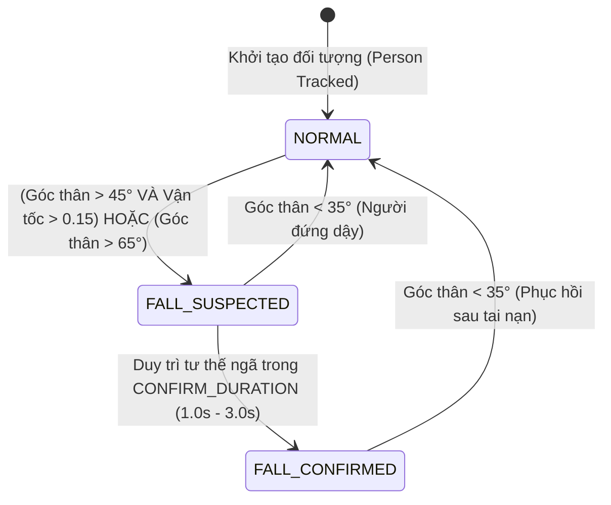

# TÀI LIỆU NGỮ CẢNH DỰ ÁN (PROJECT CONTEXT) - HỆ THỐNG NHẬN DIỆN TÉ NGÃ (FALL DETECTION AI)

---

## 1. TỔNG QUAN DỰ ÁN
- **Tên đề tài/dự án:** Hệ thống nhận diện té ngã thông minh ứng dụng thị giác máy tính và máy trạng thái (Intelligent Multi-Person Fall Detection System using YOLO Pose & MediaPipe + FSM).
- **Mục tiêu:** Phát hiện sự cố té ngã của con người tự động, theo thời gian thực từ camera/webcam hoặc video giám sát; loại trừ báo động giả (False Alarms); hỗ trợ giám sát đa người (Multi-Person Tracking) và sẵn sàng tích hợp với hệ sinh thái IoT/Cảnh báo khẩn cấp.
- **Công nghệ cốt lõi:**
  - **Ngôn ngữ:** Python 3.x
  - **Thị giác máy tính (Pose Estimation):** 
    - **YOLO Pose (YOLOv8-Pose / YOLO11-Pose):** Nhận diện và ước lượng tư thế đa người, hỗ trợ lọc lớp `Person`, độ chính xác cao trong môi trường phức tạp và khoảng cách xa.
    - **Google MediaPipe Pose:** Giải pháp ước lượng tư thế 33 điểm mốc nhẹ, tối ưu cho thiết bị cấu hình thấp / webcam 1 người.
  - **Theo dõi đối tượng (Multi-Object Tracking):** ByteTrack / BoT-SORT tích hợp trong YOLO để duy trì định danh (`track_id`) độc lập cho từng người.
  - **Xử lý hình ảnh & video:** OpenCV (`cv2`), NumPy
  - **Giải thuật logic:** Heuristic dựa trên góc nghiêng thân người, tốc độ dịch chuyển trọng tâm và Máy trạng thái hữu hạn độc lập cho từng đối tượng (Per-Person Finite State Machine - FSM).

---

## 2. CẤU TRÚC THƯ MỤC & CÁC MODULE CHÍNH
```text
d:/NCKH/
├── .venv/                              # Môi trường ảo Python chung
└── fall-detection-ai/
    ├── CONTEXT.md                      # Tài liệu kiến trúc và ngữ cảnh tổng quan dự án
    ├── REALTIME_CONTEXT.md             # Tài liệu ngữ cảnh chuyên sâu module Real-time Webcam (YOLO-Pose)
    ├── realtime_yolo_fall_detection.py # Module nhận diện té ngã Real-time qua Webcam (YOLO Pose + Multi-person)
    ├── yolo_fall_detection.py          # Module YOLOv8m-Pose + Multi-Person Tracking + State Machine (Tối ưu độ chính xác cao)
    ├── video_fall_detection_yolo.py    # Module YOLO11n-Pose xử lý video đa người
    ├── mediapipe_test.py               # Module nhận diện té ngã Real-time qua Webcam (MediaPipe Pose)
    ├── video_fall_detection.py         # Module xử lý video offline qua MediaPipe Pose
    ├── yolov8m-pose.pt                 # Trọng số mô hình YOLOv8 Medium Pose (~53MB)
    ├── yolov8n-pose.pt                 # Trọng số mô hình YOLOv8 Nano Pose (~6.8MB)
    ├── yolo11n-pose.pt                 # Trọng số mô hình YOLO11 Nano Pose (~6.2MB)
    ├── test/                           # Thư mục chứa video đầu vào và video kết quả annotate
    │   ├── sample_2.mp4
    │   ├── sample_2_yolo_output.mp4
    │   ├── video_1.mp4 ... video_6.mp4
    │   └── ...
    └── venv/                           # Môi trường ảo Python của module AI
```

---

## 3. NGUYÊN LÝ HOẠT ĐỘNG & THUẬT TOÁN

### 3.1. So sánh 2 nhánh trích xuất đặc trưng tư thế (Pose Extraction)
| Đặc tính | Nhánh MediaPipe Pose | Nhánh YOLO Pose (YOLOv8 / YOLO11) |
| :--- | :--- | :--- |
| **Số lượng điểm mốc (Keypoints)** | 33 điểm mốc (BlazePose) | 17 điểm mốc (Chuẩn COCO) |
| **Khả năng Multi-Person** | Hạn chế (ưu tiên 1 người chính) | Mạnh mẽ (Theo dõi không giới hạn số người với `track_id`) |
| **Lọc nhiễu đối tượng** | Dễ nhầm khi có vật thể/xe cộ | Lọc tuyệt đối `classes=[0]` (chỉ nhận diện người) |
| **Hiệu năng phát hiện ở xa** | Trung bình | Rất tốt khi đặt độ phân giải `imgsz=1280` |
| **Các điểm mốc trọng yếu** | Vai (11, 12), Hông (23, 24) | Vai (5, 6), Hông (11, 12), Đầu gối (13, 14), Cổ chân (15, 16) |

### 3.2. Các chỉ số tính toán cốt lõi
1. **Góc nghiêng thân người (Body Angle):**
   - Lấy trung điểm vai ($Mid_{shoulder}$) và trung điểm hông ($Mid_{hip}$).
   - Tính góc nghiêng so với phương thẳng đứng:
     $$\text{Angle} = \arctan\left(\frac{|\Delta x|}{|\Delta y| + 10^{-6}}\right) \times \frac{180}{\pi}$$
   - Góc $\text{Angle} \approx 0^\circ - 30^\circ$: Tư thế đứng / ngồi thẳng.
   - Góc $\text{Angle} > 45^\circ - 50^\circ$: Tư thế nghiêng nhiều hoặc nằm ngang sàn.
2. **Trọng tâm cơ thể (Centroid):**
   - Tọa độ trung bình của 4 điểm: 2 vai và 2 hông trên mặt phẳng chuẩn hóa.
3. **Tốc độ dịch chuyển trọng tâm (Movement Speed):**
   - Lưu trữ lịch sử vị trí và mốc thời gian trong hàng đợi (`deque`) gồm 5 frames gần nhất.
   - Vận tốc = Tổng quãng đường Euclidean di chuyển / Tổng thời gian ($\text{khoảng cách / giây}$).
   - Giúp phân biệt giữa việc **ngã đột ngột** với việc **chủ động nằm xuống từ từ**.

---

## 4. MÁY TRẠNG THÁI (STATE MACHINE) ĐA ĐỐI TƯỢNG

Mỗi người được phát hiện sẽ gắn với một instance `PersonTracker(track_id)` sở hữu một máy trạng thái riêng biệt:



### Chi tiết các trạng thái:
1. **`NORMAL` (Bình thường - Box màu xanh lá):**
   - Đối tượng đang đứng, đi bộ, hoặc ngồi bình thường.
   - Điều kiện chuyển sang `FALL_SUSPECTED`: Khi đồng thời xảy ra **tư thế nằm** (`body_angle > ANGLE_THRESHOLD`) kèm **vận tốc biến thiên nhanh** (`speed > SPEED_THRESHOLD`), hoặc ngã với góc rất lớn (`body_angle > 65°`).
2. **`FALL_SUSPECTED` (Nghi ngờ té ngã - Box màu cam):**
   - Bắt đầu tính thời gian duy trì tư thế ngã.
   - Nếu đối tượng tự đứng dậy (`body_angle < 35°`), hủy nghi ngờ và quay về `NORMAL`.
   - Nếu đối tượng tiếp tục nằm bất động vượt quá `CONFIRM_DURATION`, chuyển sang `FALL_CONFIRMED`.
3. **`FALL_CONFIRMED` (Xác nhận té ngã - Box màu đỏ / Cảnh báo toàn màn hình):**
   - Xác nhận sự cố khẩn cấp. Kích hoạt lưu vết frame và sẵn sàng bắn API/MQTT cảnh báo.
   - Tự động quay về `NORMAL` khi đối tượng hồi phục và đứng dậy (`body_angle < 35°`).

---

## 5. THÔNG SỐ CẤU HÌNH HỆ THỐNG (HYPERPARAMETERS)

| Tham số | YOLOv8m (Video Offline) | YOLOv8n (Real-time Webcam) | MediaPipe (Webcam) | Ý nghĩa |
| :--- | :--- | :--- | :--- | :--- |
| `MODEL_NAME` | `yolov8m-pose.pt` | `yolov8n-pose.pt` | `mp.solutions.pose` | Mô hình Pose Estimation sử dụng |
| `imgsz` | `1280` | `640` | `640x480` | Độ phân giải khung hình đưa vào mạng suy luận |
| `conf` / `TRACK_CONFIDENCE` | `0.15` | `0.25` | `0.5` | Ngưỡng độ tin cậy để duy trì tracking kể cả khi bị che khuất |
| `ANGLE_THRESHOLD` | `50°` | `50°` | `50°` | Ngưỡng góc nghiêng xác định tư thế nằm |
| `SPEED_THRESHOLD` | `0.20` | `0.20` | `0.35` | Ngưỡng tốc độ dịch chuyển trọng tâm đột ngột |
| `ASPECT_RATIO_THRESHOLD` | `0.88` | `0.88` | *(Không có)* | Tỉ lệ $W/H$ Bounding Box chống báo động giả khi cúi/gập người |
| `CONFIRM_DURATION` | `2.0s` | `2.5s` | `3.0s` | Thời gian bất động tối thiểu để xác nhận té ngã |

---

## 6. HƯỚNG DẪN SỬ DỤNG VÀ THỰC THI

### 6.1. Chạy nhận diện trực tiếp qua Webcam (Real-time bằng YOLO Pose - Đa người)
```bash
# Chạy với webcam mặc định (Index 0) và model yolov8n-pose.pt (tốc độ cao)
python realtime_yolo_fall_detection.py

# Hoặc chỉ định webcam index và model tùy chọn (vd: yolov8m-pose.pt)
python realtime_yolo_fall_detection.py 0 yolov8m-pose.pt
```
- Phím tắt tương tác:
  - `q` hoặc `ESC`: Thoát chương trình.
  - `r`: Reset tất cả trạng thái về `NORMAL`.
  - `f`: Bật/Tắt chế độ lật gương (Mirror Mode).
  - `s`: Lưu ảnh chụp màn hình (Snapshot).

### 6.2. Chạy nhận diện YOLOv8 Pose trên file Video (Đa người)
```bash
# Xử lý video mặc định (test/video_6.mp4 -> test/video_6_yolov8m_output.mp4)
python yolo_fall_detection.py

# Xử lý video tùy chọn
python yolo_fall_detection.py <duong_dan_input.mp4> <duong_dan_output.mp4>
```

### 6.3. Chạy nhận diện trực tiếp qua Webcam (Real-time bằng MediaPipe)
```bash
python mediapipe_test.py
```
- Phím tắt:
  - `q`: Thoát chương trình.
  - `r`: Reset thủ công trạng thái về `NORMAL`.

### 6.4. Chạy kiểm tra video bằng MediaPipe
```bash
python video_fall_detection.py <duong_dan_input.mp4> <duong_dan_output.mp4>
```

---

## 7. ĐỊNH HƯỚNG NÂNG CẤP & MỞ RỘNG (ROADMAP NCKH)
1. **Module Webcam thời gian thực với YOLO Pose:** Phát triển file `realtime_yolo_fall_detection.py` tối ưu FPS bằng CUDA/TensorRT hoặc OpenVINO.
2. **Tích hợp IoT & Cloud Gateway:**
   - Kết nối gửi bản tin cảnh báo qua MQTT Broker (HiveMQ / Mosquitto) hoặc REST API (`POST /api/v1/alerts/fall`) kèm hình ảnh snapshot khi đạt trạng thái `FALL_CONFIRMED`.
3. **Mô hình chuỗi thời gian (Spatio-Temporal GCN / LSTM):**
   - Huấn luyện mô hình ST-GCN hoặc LSTM trên chuỗi keypoints của từng người để phân biệt các hành vi phức tạp (tập thể dục, chống đẩy, cúi nhặt đồ, ngồi thiền).
4. **Giao diện Dashboard Giám Sát:**
   - Xây dựng Web Dashboard (Streamlit / FastAPI + React) hiển thị live stream các camera và nhật ký cảnh báo té ngã.
