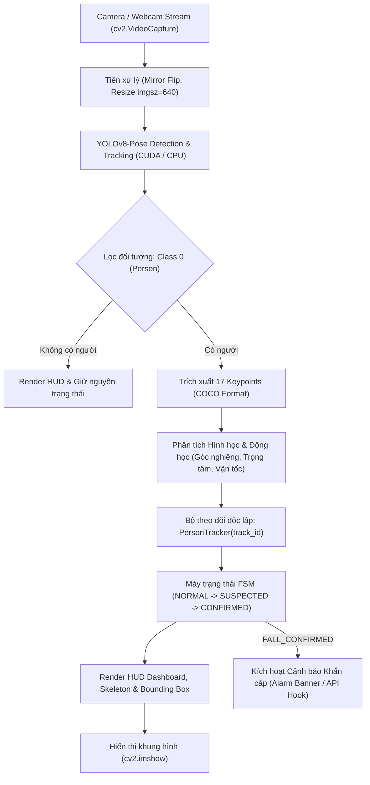
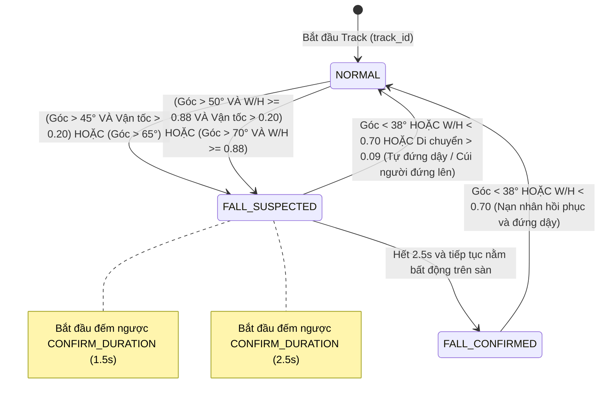

# TÀI LIỆU NGỮ CẢNH HỆ THỐNG REAL-TIME (REAL-TIME FALL DETECTION CONTEXT)
## Module Nhận Diện Té Ngã Thời Gian Thực (YOLO-Pose + Multi-Person Tracking + FSM)

---

## 1. TỔNG QUAN HỆ THỐNG REAL-TIME
- **Tên module:** Hệ thống giám sát và nhận diện té ngã theo thời gian thực (Real-time Intelligent Fall Detection System).
- **File thực thi chính:** [`realtime_yolo_fall_detection.py`](file:///Users/thai/nhan_dien_te_nga/fall-detection-ai/realtime_yolo_fall_detection.py)
- **Mục tiêu:**
  - Tiếp nhận và xử lý luồng hình ảnh trực tiếp từ Webcam/Camera giám sát (RTSP/USB) với tốc độ khung hình cao (30 - 60+ FPS).
  - Giám sát đồng thời nhiều người (Multi-Person Tracking) trong cùng một khung hình.
  - Phân biệt chính xác giữa té ngã thật sự và các hành động bình thường (ngồi xuống, cúi người, nằm nghỉ có chủ đích).
  - Tự động nhận diện khi nạn nhân đứng dậy phục hồi để đưa hệ thống về trạng thái bình thường.
  - Sẵn sàng kích hoạt các giao thức cảnh báo khẩn cấp tới **Backend C# (.NET Core Web API / SignalR)** thông qua Background Worker Thread (không làm giảm FPS camera).

---

## 2. KIẾN TRÚC PIPELINE XỬ LÝ THỜI GIAN THỰC



---

## 3. CÁC THÀNH PHẦN KỸ THUẬT CỐT LÕI

### 3.1. Trích xuất đặc trưng tư thế (Pose Keypoints)
Sử dụng mô hình **YOLOv8-Pose** để trích xuất 17 điểm mốc chuẩn COCO trên cơ thể:
- **Khớp vai:** `KP 5` (Vai trái), `KP 6` (Vai phải).
- **Khớp hông:** `KP 11` (Hông trái), `KP 12` (Hông phải).
- **Khớp chân:** `KP 13, 14` (Đầu gối), `KP 15, 16` (Cổ chân).

### 3.2. Chỉ số tính toán động học thời gian thực
1. **Góc nghiêng thân người (Body Angle):**
   - Tính toán dựa trên vector nối giữa trung điểm hai vai ($Mid_{shoulder}$) và trung điểm hai hông ($Mid_{hip}$):
     $$\text{Angle} = \arctan\left(\frac{|\Delta x|}{|\Delta y| + 10^{-6}}\right) \times \frac{180}{\pi}$$
   - Giá trị $> 45^\circ$: Tư thế nghiêng nhiều hoặc nằm ngang sàn.
   - Giá trị $< 35^\circ$: Tư thế đứng thẳng hoặc ngồi thẳng.
2. **Trọng tâm cơ thể (Centroid):**
   - Trung bình cộng tọa độ chuẩn hóa $[0, 1]$ của 4 điểm trọng yếu (2 vai, 2 hông).
3. **Vận tốc dịch chuyển trọng tâm (Movement Speed):**
   - Tính toán độ dịch chuyển Euclidean chia cho khoảng thời gian $\Delta t$ trên hàng đợi trượt `deque(maxlen=5)`:
     $$v = \frac{\sum_{i=1}^{N-1} \sqrt{(x_i - x_{i-1})^2 + (y_i - y_{i-1})^2}}{t_N - t_0} \quad (\text{tỉ lệ màn hình / giây})$$
   - Phát hiện xung động lực khi ngã đập xuống sàn (`speed > 0.20`).

---

## 4. MÁY TRẠNG THÁI HỮU HẠN ĐA ĐỐI TƯỢNG (PER-PERSON FSM)

Mỗi người trong tầm quan sát sở hữu một máy trạng thái độc lập được đóng gói trong class `PersonTracker`:



### Bảng chuyển dịch trạng thái chi tiết:

| Trạng thái hiện tại | Sự kiện kích hoạt | Trạng thái tiếp theo | Ý nghĩa thực tế |
| :--- | :--- | :--- | :--- |
| **`NORMAL`** (Xanh lá) | `angle > 50°` VÀ `W/H >= 0.88` VÀ `speed > 0.20` | `FALL_SUSPECTED` | Người ngã sụp xuống sàn đột ngột |
| **`NORMAL`** (Xanh lá) | `angle > 70°` VÀ `W/H >= 0.88` | `FALL_SUSPECTED` | Nằm bẹp ra sàn với góc nghiêng cực lớn |
| **`FALL_SUSPECTED`** (Cam) | `elapsed >= 2.5s` VÀ vẫn nằm sàn | `FALL_CONFIRMED` | **Xác nhận té ngã** sau thời gian theo dõi |
| **`FALL_SUSPECTED`** (Cam) | `angle < 38°` HOẶC `W/H < 0.70` HOẶC `elapsed >= 2.5s` nhưng không nằm | `NORMAL` | Hủy nghi ngờ (ngồi dậy, nhặt đồ hoặc đứng gập người) |
| **`FALL_CONFIRMED`** (Đỏ) | `angle < 38°` HOẶC `W/H < 0.70` | `NORMAL` | Nạn nhân đã hồi phục và tự đứng dậy |

---

## 5. THÔNG SỐ CẤU HÌNH (HYPERPARAMETERS)

| Tham số | Giá trị | Đơn vị | Mục đích tối ưu |
| :--- | :--- | :--- | :--- |
| `MODEL_NAME` | `yolov8n-pose.pt` | File weight | Đảm bảo tốc độ khung hình 30 - 60 FPS trên camera trực tiếp |
| `INFERENCE_SIZE` | `640` | Pixels | Cân bằng hoàn hảo giữa độ chính xác và độ trễ real-time |
| `TRACK_CONFIDENCE` | `0.25` | Tỉ lệ (0-1) | Duy trì ID tracking ổn định kể cả khi cơ thể ngã sát sàn |
| `ANGLE_THRESHOLD` | `50` | Độ ($^\circ$) | Ngưỡng phân định giữa tư thế đứng/ngồi và tư thế nằm |
| `SPEED_THRESHOLD` | `0.20` | Tỉ lệ/s | Ngưỡng phát hiện vận tốc rơi nhanh đột ngột |
| `ASPECT_RATIO_THRESHOLD` | `0.88` | Tỉ lệ $W/H$ | **Chống báo động giả khi cúi người**: Người nằm sàn có $W/H \ge 0.88$, đứng cúi người có $W/H < 0.80$ |
| `CONFIRM_DURATION` | `2.5` | Giây | Thời gian xác nhận nằm bất động (giảm tối đa False Positives) |
| `MOVEMENT_TOLERANCE` | `0.03` | Tỉ lệ màn hình | Ngưỡng xác định cơ thể có đang bất động hay không |

---

## 6. GIAO DIỆN ĐIỀU KHIỂN & PHÍM TẮT (HUD INTERFACE)

### 6.1. Bố cục giao diện hiển thị
- **Top HUD Bar:** Hiển thị Tên mô hình, Thiết bị tăng tốc phần cứng (`CUDA` / `CPU`), `FPS` tức thời, và `Số lượng người đang track`.
- **Bounding Box & Label:** 
  - Đóng khung từng đối tượng kèm màu trạng thái (Xanh lá / Cam / Đỏ).
  - Nhãn hiển thị: `ID:<track_id> | <STATE> | <ANGLE>deg` kèm đồng hồ đếm ngược thời gian xác nhận.
- **Khung xương (Skeleton):** Nối các khớp xương chính với màu xanh Cyan.
- **Banner Cảnh báo Khẩn cấp:** Viền đỏ toàn màn hình kèm hộp thông báo chữ lớn `!!! PHAT HIEN TE NGA (FALL DETECTED) !!!`.

### 6.2. Các phím tắt tương tác trong lúc chạy
| Phím tắt | Chức năng |
| :--- | :--- |
| **`q`** hoặc **`ESC`** | Thoát ứng dụng an toàn và giải phóng tài nguyên Camera. |
| **`r`** | Reset thủ công tất cả trạng thái của mọi người về `NORMAL`. |
| **`f`** | Bật / Tắt chế độ soi gương (Mirror Mode). |
| **`s`** | Chụp và lưu ngay frame ảnh hiện tại thành file `snapshot_fall_<timestamp>.jpg`. |

---

## 7. KẾT QUẢ KIỂM THỬ THỰC TẾ & HIỆU NĂNG PHẦN CỨNG (HARDWARE BENCHMARK)

### 7.1. Cấu hình phần cứng kiểm thử
- **GPU:** NVIDIA GeForce GTX 1070 (8GB VRAM)
- **PyTorch & CUDA:** PyTorch 2.7.1 + CUDA 11.8
- **Tốc độ suy luận thô (Raw YOLOv8n-pose Inference):** **44.4 FPS** (~22.5 ms/frame) trên độ phân giải `imgsz=640`.

### 7.2. Tối ưu hóa FPS luồng Camera (Video Stream Optimization)
- **Vấn đề đã khắc phục:** Backend mặc định MSMF trên Windows giới hạn băng thông USB Camera ở 10 - 15 FPS khi mở 720p không nén.
- **Giải pháp áp dụng:** Sử dụng `cv2.CAP_DSHOW` (DirectShow) kết hợp ép nén định dạng `cv2.CAP_PROP_FOURCC = 'MJPG'` để giải phóng tốc độ camera lên **30 - 60 FPS**.
- **Cơ chế Warm-up:** Khởi tạo 3 frames giả lập trước khi mở camera để nạp CUDA kernel, giúp FPS tức thời ổn định ngay từ giây đầu tiên.

### 7.3. Nhật ký kiểm thử thực nghiệm (Test Log)
```text
=================================================================
Khoi tao Fall Detection Real-time (GPU Accelerated)
- Model: yolov8n-pose.pt
- Thiet bi tinh toan (Device): NVIDIA GeForce GTX 1070
- Camera Index: 0
- Nguong xac nhan: Angle > 50deg | W/H >= 0.88 | Time >= 2.5s
=================================================================
Dang tai model YOLO-Pose...

>>> DANG CHAY REALTIME. Nhan 'q' de thoat, 'r' de reset, 'f' de doi mirror, 's' de chup anh <<<

[CANH BAO] Phat hien nguoi ID 1 TE NGA luc 10:52:13! (Angle: 87deg, W/H: 4.84)
[THONG TIN] Nguoi ID 1 da dung day tro lai binh thuong.
```
- **Đánh giá hiệu năng thực tế:**
  - Tăng tốc phần cứng thành công trên GPU NVIDIA GeForce GTX 1070.
  - Phản ứng phát hiện té ngã chính xác khi người ngã áp sàn ($\text{Angle} = 87^\circ$, tỉ lệ khung bao ngang $\text{W/H} = 4.84 \ge 0.88$).
  - Động tác cúi người/gập người không còn bị báo động giả nhờ bộ lọc đa tiêu chí ($\text{Angle} + \text{W/H} + \text{Hip Drop}$).
  - Tự động nhận diện nạn nhân đứng dậy và hoàn trả trạng thái về `NORMAL` tức thì.

---

## 9. THÔNG TIN THƯ VIỆN & TẬP DỮ LIỆU HUẤN LUYỆN (DATASET & PRETRAINED MODEL)
- **Tập dữ liệu mặc định:** **COCO 2017 Keypoint Detection Dataset** (`coco-pose`).
- **Nguồn gốc:** Train chính thức bởi Ultralytics trên 118,287 ảnh thực tế với 17 điểm khớp xương chuẩn COCO.
- **Tải weights model:** Tự động tải `yolov8n-pose.pt` (6.8MB) khi khởi chạy lần đầu.
- **Link tài liệu chính thức:**
  - [Ultralytics Pose Datasets](https://docs.ultralytics.com/datasets/pose/)
  - [COCO Official Keypoint Task](https://cocodataset.org/#keypoints-2017)

---

## 10. HƯỚNG DẪN TÍCH HỢP HỆ THỐNG BACKEND C# (.NET CORE)
Khi trạng thái chuyển sang `FALL_CONFIRMED` hoặc `RECOVERED`, hệ thống đẩy bản tin JSON sang C# Backend. Để **tránh giảm FPS của camera**, sử dụng một **Worker Thread ngầm** kết hợp với hàng đợi `queue.Queue`:

```python
import queue
import threading
import requests
import base64
import time
import cv2

# Cấu hình C# Backend
BACKEND_ALERT_URL = "http://localhost:5000/api/alerts/fall"
CAMERA_ID = "CAM_01"

alert_queue = queue.Queue(maxsize=20)

def backend_sender_worker():
    """Luồng phụ gửi HTTP sang C# Backend mà không gây nghẽn/tụt FPS camera"""
    while True:
        payload = alert_queue.get()
        if payload is None:
            break
        try:
            res = requests.post(BACKEND_ALERT_URL, json=payload, timeout=2.5)
            print(f"[C# BACKEND] Gửi cảnh báo thành công (Status: {res.status_code})")
        except Exception as err:
            print(f"[C# BACKEND ERROR] Không thể kết nối tới Backend: {err}")
        alert_queue.task_done()

# Khởi động thread gửi nền
sender_thread = threading.Thread(target=backend_sender_worker, daemon=True)
sender_thread.start()

def send_alert_to_csharp(track_id, state, angle, ar, box, frame):
    """Đóng gói dữ liệu chuẩn PascalCase/camelCase gửi cho C# Backend"""
    b64_str = None
    if frame is not None:
        success, buffer = cv2.imencode('.jpg', frame, [int(cv2.IMWRITE_JPEG_QUALITY), 75])
        if success:
            b64_str = f"data:image/jpeg;base64,{base64.b64encode(buffer).decode('utf-8')}"

    payload = {
        "eventId": f"evt_{int(time.time() * 1000)}",
        "eventType": "FallConfirmed" if state == "FALL_CONFIRMED" else "Recovered",
        "severity": "Critical" if state == "FALL_CONFIRMED" else "Info",
        "timestamp": time.strftime('%Y-%m-%dT%H:%M:%S+07:00'),
        "cameraId": CAMERA_ID,
        "person": {
            "trackId": int(track_id),
            "state": state,
            "bodyAngle": round(float(angle), 1) if angle is not None else 0.0,
            "aspectRatio": round(float(ar), 2) if ar is not None else 0.0,
            "boundingBox": {
                "x1": int(box[0]), "y1": int(box[1]),
                "x2": int(box[2]), "y2": int(box[3])
            } if box is not None else None
        },
        "snapshotBase64": b64_str
    }

    if not alert_queue.full():
        alert_queue.put(payload)
```


